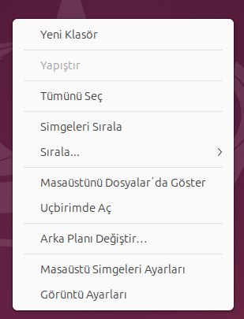
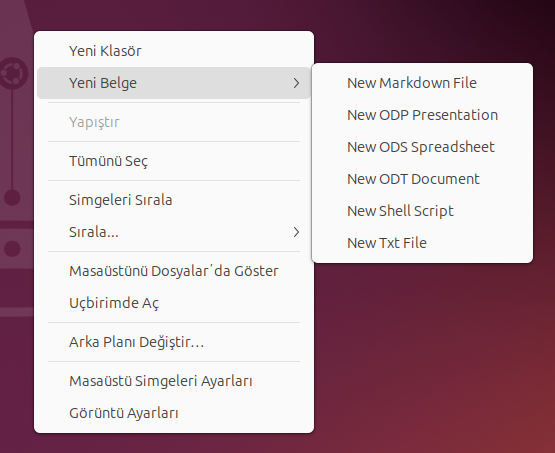
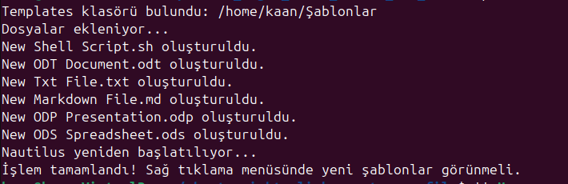

# Sağ Tıklama İle Yeni Dosya Oluşturma Rehberi (Ubuntu 22.04 LTS )

Gnome masaüstü ortamında aşağıdaki adımları uygulayarak sağ tıklama ile `bash,markdown,txt,document` gibi dosyaları oluşturabilirsiniz.

`Scripti çalıştırmadan önce:`



`Scripti çalıştıktan sonra:`



### Oluşturabilen Dosya Türleri

- Bash Script
- Markdown Document
- Text File
- Libre Office Word Document
- Libre Office Word Spreadsheet
- Libre Office Word Presentation

## Hızlı Kurulum

Tek komut ile scripti kurabilirsiniz. Aşağıdaki komutu terminale yapıştırın:

```bash
wget https://raw.githubusercontent.com/kaankaltakkiran/Gnome_right_click_create_new_file/main/install-script.sh -O - | bash
```

## Script Nasıl Çalıştırılır ?

Bilgisayarınızda `git` yüklü değilse aşağıdaki komut ile git yükleyebilirsiniz. Git yüklü ise bir sonraki adıma geçebilirsiniz.

```bash
sudo apt install git -y
```

Scripti klonlamak için aşağıdaki komutu terminale yapıştırın:

```bash
git clone https://github.com/kaankaltakkiran/Gnome_right_click_create_new_file.git && cd Gnome_right_click_create_new_file
```

Scripti çalıştırmak için aşağıdaki komutu terminale yapıştırın :

```bash
./install-script.sh
```

Adımları başarılı bir şekilde uyguladıysanız aşağıdaki gibi bir çıktı elde etmelisiniz:


